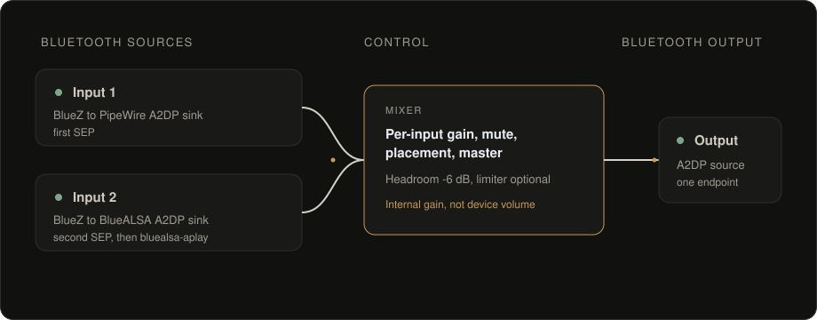

<p align="center">
  <picture>
    <source media="(prefers-color-scheme: dark)" srcset="web/assets/logo-wordmark-light.svg">
    
  </picture>
</p>

<p align="center">
  <a href="LICENSE"></a>
  
  
  
  
</p>

# OpenAudioHub

A headless Bluetooth audio mixer and control panel for small single-board
computers. Connect **two** Bluetooth sources at once, mix them with independent
gain and ear placement, and send the result to **one** Bluetooth headset or
speaker, all controlled from a local web page, with no cloud dependency.

Reference target: **Orange Pi Zero 2W** running Armbian / Debian Trixie.
Current version: **1.0.1**. See [Status](#status) for what is verified on hardware.

## What it does

- Mixes two simultaneous Bluetooth audio sources (phone + laptop, two phones, …)
  into a single Bluetooth output.
- Per-input mixer gain, mute and channel placement (**Both / Left / Right**), plus
  master gain, master mute and headroom.
- Keeps **Bluetooth device volume** and **internal mixer gain** as two separate,
  clearly labelled controls.
- Bluetooth pairing, auto-connect, Wi-Fi and hub identity managed from the browser.
- Live state over Server-Sent Events: no polling and no page reloads, and open
  controls are never reset by incoming telemetry.
- Single shared password; the whole interface is served from the device itself.

## How the audio path works



Two independent A2DP sink endpoints are registered so that two sources can be
connected at the same time:

| Slot | Pipeline |
|---|---|
| Input 1 | source → BlueZ → PipeWire / WirePlumber A2DP sink |
| Input 2 | source → BlueZ → patched BlueALSA A2DP sink → `bluealsa-aplay` → ALSA `default` → PipeWire |
| Output 1 | PipeWire mix → WirePlumber A2DP source → BlueZ → headset or speaker |

Because OpenAudioHub registers exactly two A2DP sink endpoints, a third source is
refused by BlueZ with *device or resource busy*. That is a capacity limit, not a
fault. Details: [`docs/ARCHITECTURE.md`](docs/ARCHITECTURE.md).

## Requirements

**Hardware**

- A single-board computer with Bluetooth and Wi-Fi. The Orange Pi Zero 2W is the
  reference device; 1 GB of RAM is sufficient.
- One or two Bluetooth audio sources and one Bluetooth audio output.

**Operating system**

- Debian Trixie (13), or a Debian-based distribution such as Armbian. `arm64` is
  the reference architecture; `amd64` is also supported by the installer.
- A normal login user to own the PipeWire session. The installer picks the first
  regular user automatically, or you can set `OPENAUDIOHUB_USER`.

**Software**, installed automatically: BlueZ, PipeWire with WirePlumber, the
BlueALSA utilities, Python 3 with the PyYAML/D-Bus/GObject bindings, `iw`,
Netplan, Avahi and RTKit. The Go daemon ships prebuilt for `arm64` and `amd64`, so
Go is not needed on the target; the isolated BlueALSA receiver is compiled on the
target and takes a few minutes on a 1 GB board.

Use **5 GHz Wi-Fi** where possible: the board already carries Bluetooth audio in
the 2.4 GHz band.

## Install

Read [`docs/SETUP.md`](docs/SETUP.md) first. Installation **interrupts audio** and
needs `sudo`. It does not intentionally change Wi-Fi settings or remove Bluetooth
pairings.

```bash
cd OpenAudioHub
sudo bash scripts/install.sh
```

The installer:

1. installs the runtime packages;
2. builds the isolated, pinned BlueALSA receiver **before** stopping any working
   service, so a failed build never leaves the device without audio;
3. stops OpenAudioHub-owned services and retires obsolete player units;
4. installs the daemon, web UI and systemd units;
5. asks for a web password (8+ characters) on a first install.

The isolated receiver is installed to
`/usr/local/lib/openaudiohub/bluealsa-4.3.1-oah`. The distribution's
`/usr/bin/bluealsa` is left untouched and its package is never modified with
`make install`.

If you keep a local BlueALSA checkout, point the build at it:

```bash
sudo env OPENAUDIOHUB_BLUEALSA_SOURCE=/home/<user>/src/bluez-alsa-bp35 \
  bash scripts/install.sh
```

The build exports the pinned upstream commit from that repository; your working
tree is never copied or modified.

## First-run setup

Open **http://openaudiohub.local/** (or `http://<hub-ip>/`) and sign in.

Adding a **source** and adding an **output** run Bluetooth pairing in opposite
directions, which is why the Devices screen offers both **Start pairing** and
**Scan**. Only sources need pairing mode. Outputs are added by scanning.

### Add a source: phone, computer, tablet

The source connects to the hub from its own side, so the hub has to be
advertised as discoverable first.

1. **Devices → Start pairing.** The hub becomes discoverable for a short window,
   with the remaining time shown on the button.
2. On the phone or computer, open Bluetooth settings and select the hub
   (`OpenAudioHub` by default).
3. Assign the device to **Input 1** or **Input 2**.

### Add an output: headset, speaker

The hub is the side that connects here, so you discover the device instead of
advertising the hub. **Pairing mode is not needed**, so leave it off.

1. Put the headset or speaker into *its own* pairing mode.
2. **Devices → Scan.** The device appears in the list as it is discovered.
3. Press **Pair** on its card, then assign it to **Output 1**.

### Finish

On the **Dashboard**, confirm the signal path shows *Connected* for every slot you
filled, then set the mixer levels.

## The web interface

| Screen | Purpose |
|---|---|
| **Dashboard** | Signal path, per-input mixer, master controls, and a health strip for Wi-Fi, Bluetooth and audio. |
| **Devices** | Pairing and scanning, role assignment, auto-connect, connect/disconnect/forget, Bluetooth volume, receiver settings. |
| **Network** | Current network, band/channel/signal, other networks, and join with automatic rollback. |
| **Audio** | Presets, sample rates, buffers and latency, codec policy, secondary receiver, experimental A/V delay report. |
| **System** | Hostname and Bluetooth name, about, restart audio graph, backup, reboot, change password. |
| **Diagnostics** | CPU, memory, temperature, PipeWire errors, transports, service states and recent logs. |

### Two separate volume controls

- **Bluetooth volume** on each device card changes the volume of the remote
  Bluetooth device / transport.
- **Mixer gain** on the Dashboard is local digital processing inside PipeWire.

They are intentionally independent: changing one does not rewrite the other.

### Audio presets

| Preset | Quantum | BlueALSA period / buffer |
|---|---|---|
| Low latency | 1024 | 50 ms / 200 ms |
| Balanced *(default)* | 2048 | 100 ms / 500 ms |
| Maximum stability | 4096 | 100 ms / 500 ms |

Editing any value switches the preset to **Custom**. Applying settings restarts
the audio graph and briefly interrupts playback.

### BlueALSA receiver (SBC maximum)

The SBC maximum bitpool can be **35**, **53**, **64** or **250**. It applies to the
**BlueALSA receiver only** (Input 2). It is not a separate cap on both inputs,
and the source must reconnect before a new value takes effect. The default of 35
is a compatibility trade-off. One binary handles every value, so changing it does
not recompile anything and does not restart the primary input.

### Experimental A/V delay report

*Advertised total sink delay* (0–2000 ms) asks the secondary receiver to report a
fixed **total** rendering delay to its source. It applies to **Input 2 only**, the
BlueALSA receiver. **Input 1 runs on PipeWire, whose owning process exposes no
supported way to write this value, so Input 1 is unsupported and unaffected.**

**Zero keeps the engine default** and reports nothing. The number is the total
latency from source to ears, **not** extra buffering, and there is deliberately no
separate offset control, a residual error belongs inside this total, not added on
top of it. Headphone or output latency you measured is already part of the total.

The card reports what was actually observed rather than what was saved. Saving a
value or restarting a service is never shown as success:

| Status | Meaning |
|---|---|
| Engine default | Requested 0. |
| Pending confirmation | Applied; the acquired transport does not show it yet. |
| Reported | The acquired transport currently exposes the requested total. |
| Rejected | BlueZ refused the write from the owning connection. |
| Not confirmed | Accepted, but the transport does not show it. |
| Not supported here | No delay-report support available. |

**Apply to receiver** changes only this value without restarting the audio graph.
**Reset to 0** returns to the engine default. BlueZ accepting a report is not proof
that the source corrected its video. Only re-measuring shows that. The on-device
calibration test is in [`docs/SETUP.md`](docs/SETUP.md).

## Files and permissions

| Path | Purpose | Mode |
|---|---|---|
| `/etc/openaudiohub/config.json` | Full configuration, including the password hash | `0600 root:root` |
| `/etc/openaudiohub/audio.json` | Non-secret audio projection read by the unprivileged bridge | `0644` |
| `/etc/openaudiohub/runtime.env` | Audio user, UID and home directory | `0644` |
| `/var/lib/openaudiohub/` | Device-name cache, Netplan backups, upgrade backups | — |
| `/usr/share/openaudiohub/web` | Web UI | — |

Do not relax the permissions on `config.json`; the bridge reads only `audio.json`
precisely so it never needs the file that holds the password hash.

## Wi-Fi changes and rollback

Joining a network writes the new configuration and then arms a **60-second
rollback** before applying it. If the hub does not come back on the new network,
the previous Netplan configuration is restored automatically. Reconnect and press
**Confirm** in the Network banner to keep the new network.

## Backup, restore and removal

- **Backup**: System → *Download configuration backup*: a zip containing
  `config.json`, `audio.json` and `wireplumber.conf`.
- **Restore**: uploads `config.json` and `audio.json` from a backup.
- **Uninstall**: `sudo bash scripts/uninstall.sh` removes the services and
  binaries; configuration and Bluetooth pairings are preserved.

## Troubleshooting

Start with the basics:

```bash
/usr/local/bin/openaudiohubd --version
sudo systemctl status openaudiohubd --no-pager
curl --max-time 5 http://127.0.0.1/api/health
pgrep -af 'bluealsa|bluealsa-aplay'
```

| Symptom | Likely cause |
|---|---|
| A third source will not connect | Only two A2DP sink endpoints exist. Disconnect an unassigned source first. |
| A phone or computer cannot find the hub | Pairing mode has already expired. Press **Start pairing** again and retry from the device's Bluetooth settings. |
| A headset or speaker never appears | Put the headset or speaker into *its own* pairing mode first, then press **Scan**. The hub's pairing mode is unrelated. |
| Health strip reports "No output" | Assign and connect **Output 1** under Devices. |
| Audio controls show "recovering" | The PipeWire control socket is restarting; the daemon heals it automatically. |
| Wi-Fi sits on 2.4 GHz | It will compete with Bluetooth audio. Prefer 5 GHz. |
| Secondary source is silent | Check `openaudiohub-bluealsa` and `openaudiohub-bluealsa-bridge` under Diagnostics. |
| A source shows *Connecting…* but never connects | Its A2DP profile failed while the generic link stayed up. Reconnect it from Devices. |

**Copy diagnostics** under Diagnostics produces a shareable JSON summary. Only ever
run **one** BlueALSA daemon and **one** `bluealsa-aplay`: starting a second one
alongside the managed stack will conflict. [`docs/SETUP.md`](docs/SETUP.md)
contains the full recovery procedure.

## Development

Requires Go 1.23+, Python 3, Bash, and Node.js only for optional syntax checks.
Production runs neither Node nor a frontend framework.

```bash
go test ./...
go vet ./...
go test -race ./...
python3 tests/test_runtime.py
python3 tests/browser_regression.py   # needs Playwright and Chromium
make release                          # cross-compile both daemon binaries
```

The web UI is plain ES modules under `web/` and has no build step. The daemon is
standard-library Go under `cmd/` and `internal/oah/`. Packaging scripts, systemd
units and the BlueALSA patch live under `scripts/`, `packaging/` and `patches/`.

## Status

The host-side test suite passes, and the core audio path has been exercised on
real hardware: install and upgrade, Bluetooth pairing, output switching, and the
A/V rendering-delay report. Some integration is unverified — more than two
simultaneous sources, dual Bluetooth outputs, and the update install path.
[`VALIDATION.md`](VALIDATION.md) records which checks were run and which remain
open; [`docs/SETUP.md`](docs/SETUP.md) has the on-device acceptance checklist.

## License

MIT. See [`LICENSE`](LICENSE). The isolated receiver binary is built from
MIT-licensed [bluez-alsa](https://github.com/arkq/bluez-alsa); its upstream notice
is installed alongside the binary. See [`docs/RECEIVER.md`](docs/RECEIVER.md) for
source provenance and reproduction steps.
